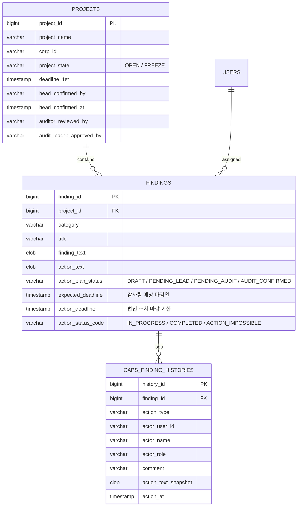
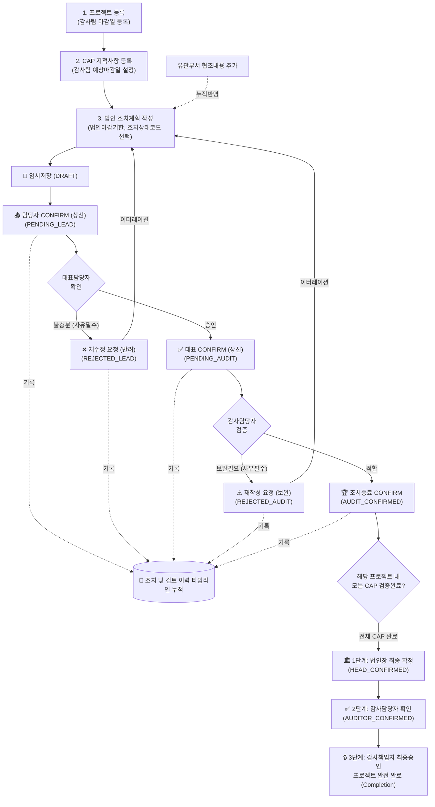

# 글로벌 세아(SAE-A) 감사 지적사항(CAP) 관리 시스템 개발 종합 보고서

본 문서는 **감사 지적사항(CAP: Corrective Action Plan) 관리 및 법인 조치 모니터링 시스템**의 전체 개발 내역, 시스템 아키텍처, 데이터베이스 모델, 메뉴별 기능 명세, 결재 워크플로우 및 실행 가이드를 일목요연하게 정리한 종합 기술 문서입니다.

---

## 📌 목차
1. [시스템 개요 및 개발 목적](#1-시스템-개요-및-개발-목적)
2. [기술 스택 및 아키텍처](#2-기술-스택-및-아키텍처)
3. [데이터베이스 설계 및 스키마 (DDL)](#3-데이터베이스-설계-및-스키마-ddl)
4. [역할 기반 권한 관리 (RBAC)](#4-역할-기반-권한-관리-rbac)
5. [메뉴별 주요 기능 및 화면 명세](#5-메뉴별-주요-기능-및-화면-명세)
6. [업무 프로세스 및 결재선 워크플로우](#6-업무-프로세스-및-결재선-워크플로우)
7. [주요 REST API 엔드포인트 명세](#7-주요-rest-api-엔드포인트-명세)
8. [시스템 실행 및 운영 가이드](#8-시스템-실행-및-운영-가이드)

---

## 1. 시스템 개요 및 개발 목적

### 1.1 배경 및 목적
- **감사실-피감법인 간 실시간 협업 체계 구축**: 감사 지적사항 발생 시부터 개선 조치 완료까지의 전 과정을 단일 웹 플랫폼에서 통합 관리.
- **체계적인 조치 기한 관리**: 감사팀의 예상 마감일과 법인의 자체 조치 마감 기한을 분리하여 책임 있는 일정 관리 체계 확립.
- **엄격한 이터레이션(반복 검토) 및 이력 관리**: 불충분한 조치에 대해 사유를 명시한 재수정/재작성 요청을 지원하며, 모든 검토 및 조치 내역을 타임라인으로 누적 보존.
- **법인장 최종 확정 및 프로젝트 완료(Completion)**: 개별 CAP이 모두 종료된 후 법인장과 감사책임자의 최종 승인을 거쳐 데이터 변경을 원천 차단하는 무결성 보장.

---

## 2. 기술 스택 및 아키텍처

```
[ Frontend (React 18 + Vite) ]
        │  ▲
   REST │  │ JSON (Axios)
        ▼  │
[ Backend (Spring Boot 3.3.x / Java 17) ]
        │
   JPA / Hibernate / Spring JDBC
        │
        ▼
[ Database (H2 / RDBMS) ]
```

| 영역 | 기술 / 라이브러리 | 설명 |
| :--- | :--- | :--- |
| **Frontend** | React 18, Vite 5 | SPA 기반 고성능 UI/UX 구축 |
| | Vanilla CSS / Custom Design System | 글로벌 세아 Corporate Navy(#0c1b30) & Blue(#0077C8) 테마 |
| | ContentEditable Rich Text Editor | 조치내역 서식, 표(Table), 리스트, 글자색상 편집 지원 |
| | Axios | RESTful 비동기 데이터 통신 |
| **Backend** | Java 17, Spring Boot 3.3.x | 안정적인 엔터프라이즈 백엔드 API 서버 |
| | Spring Data JPA / Spring JDBC | ORM 및 기동 시 DDL/컬럼 자동 패치 처리 |
| | Jakarta Validation, BCrypt | 입력 데이터 유효성 검증 및 패스워드 암호화 |
| **Database** | H2 Database / Relational DB | 자동 스키마 업데이트 및 이력 스냅샷 적재 |

---

## 3. 데이터베이스 설계 및 스키마 (DDL)

### 3.1 주요 테이블 구조 요약



### 3.2 신규 반영 핵심 DDL

```sql
-- 1. 지적사항(CAP) 테이블 확장 필드
ALTER TABLE FINDINGS ADD COLUMN expected_deadline TIMESTAMP;       -- 감사팀 예상 마감일
ALTER TABLE FINDINGS ADD COLUMN action_deadline TIMESTAMP;         -- 법인 조치 마감 기한
ALTER TABLE FINDINGS ADD COLUMN action_status_code VARCHAR(50);    -- 조치 상태 코드 (IN_PROGRESS 등)

-- 2. 프로젝트 테이블 법인장 최종 확정 필드
ALTER TABLE PROJECTS ADD COLUMN head_confirmed_by VARCHAR(50);     -- 법인장 확정자 ID
ALTER TABLE PROJECTS ADD COLUMN head_confirmed_at TIMESTAMP;       -- 법인장 확정 일시
ALTER TABLE PROJECTS ADD COLUMN head_comment VARCHAR(1000);        -- 법인장 확정 코멘트

-- 3. 조치 및 검토 이력 타임라인 테이블
CREATE TABLE IF NOT EXISTS CAPS_FINDING_HISTORIES (
    history_id BIGINT AUTO_INCREMENT PRIMARY KEY,
    finding_id BIGINT NOT NULL,
    action_type VARCHAR(50) NOT NULL,
    actor_user_id VARCHAR(50) NOT NULL,
    actor_name VARCHAR(100),
    actor_role VARCHAR(50),
    comment VARCHAR(1000),
    action_text_snapshot CLOB,
    action_at TIMESTAMP DEFAULT CURRENT_TIMESTAMP
);
```

---

## 4. 역할 기반 권한 관리 (RBAC)

| 역할 코드 (`role`) | 한글 명칭 | 주관 업무 및 권한 범위 |
| :--- | :--- | :--- |
| `SYSTEM_ADMIN` | 시스템 관리자 | 전체 화면 접근, 계정 생성/권한 제어, 모든 결재 단계 강제 수행 |
| `AUDIT_LEADER` | 감사책임자 | 감사 프로젝트 총괄, 프로젝트 최종 승인 및 완료(`Completion`) |
| `AUDITOR` | 감사담당자 | 프로젝트/CAP 등록, 법인 제출 조치 검증(CONFIRM) 및 재작성 요청 |
| `CORP_HEAD` | 법인장 | 소속 법인 프로젝트 최종 확정(`HEAD_CONFIRMED`) |
| `LEAD_REP` | 법인대표담당 | 소속 법인 조치내용 1차 확인(CONFIRM) 및 재수정 요청(반려) |
| `MEMBER` | 법인담당자 | 배정된 CAP에 대한 조치기한 설정, 조치내용 작성, 임시저장 및 상신 |
| `DEPT_MEMBER` | 유관부서 | 타 부서 협조자로서 지적사항 조치내용 및 협조 의견 추가 등록 |
| `EXEC` | 경영진 | 전체 진행률 및 현황 모니터링 (Read-only) |

---

## 5. 메뉴별 주요 기능 및 화면 명세

### [메뉴 1] 프로젝트 등록 (감사팀) - `PROJECT_REGISTER`
- **주요 기능**:
  - 연도 및 법인명 기반 프로젝트 생성 (예: `2026_법인A`).
  - 피감 법인 선택 및 소속법인 접근 허용 사용자 다중 지정.
  - 유관부서(`DEPT_MEMBER`) 사용자 추가 권한 부여.
  - **마감일 단일화**: 1차 마감일 1개만 입력받도록 간소화 (2차/3차 숨김 처리 완료).

### [메뉴 2] 조치계획 및 필수사항 입력 - `ACTION_PLAN_INPUT`
- **주요 기능**:
  - **그리드 목록**: 법인, 프로젝트, 담당자, 지적사항명, **감사팀 예상 마감일**, **법인 조치 마감 기한**, **결재/검증 현황**, **조치 상태** 실시간 조회.
  - **4단계 스텝 바**: `1.법인담당자 조치 ➔ 2.대표담당자 확인 ➔ 3.감사실 검증 ➔ 4.조치종료(CONFIRM)`.
  - **조치 설정 바**:
    - **법인 조치 마감 기한**: Datepicker를 통해 법인 담당자가 자율적 조치 완료 목표일 등록.
    - **조치 상태 구분 (코드로 관리)**: `🟡 조치중 (IN_PROGRESS)` / `🟢 조치완료 (COMPLETED)` / `🔴 조치불가 (ACTION_IMPOSSIBLE)`.
  - **Rich Text 에디터**: 폰트 서식, 리스트, 색상 선택, 표(Table) 삽입 등 풍부한 조치내용 작성 지원.
  - **유관부서 협조 내용/의견 추가 박스**: 유관부서 담당자가 추가 의견을 등록하면 기존 조치내역과 타임라인에 즉시 누적 반영.
  - **하단 이력 타임라인 카드**: 처리일시, 처리자, 변경상태 뱃지, 반려/보완 코멘트, 당시 조치내용 스냅샷 토글 열람.
  - **증빙 업로드**: 파일 첨부 및 유효성 검증(최대 50MB, 위험 확장자 차단).

### [메뉴 3] 발견사항 (CAP) 관리 및 피드백 - `FINDING_MANAGEMENT`
- **주요 기능**:
  - 특정 프로젝트에 귀속되는 개별 CAP 지적사항 신규 등록 및 수정.
  - 대분류 카테고리 관리 (재무, IT보안, 컴플라이언스 등 동적 추가/수정/삭제).
  - 복수의 담당 감사자(`auditorsInCharge`) 지정.
  - **감사팀 예상 마감일 (`expectedDeadline`)** 지정 (1차 기준 마감일 단일화).

### [메뉴 8] 법인장 최종 확정 결재 - `HEAD_FINAL_APPROVAL` *(신규)*
- **주요 기능**:
  - **좌측 프로젝트 리스트**: 소속 프로젝트의 CAP 완료율(`완료 N/M건`) 및 결재 상태 뱃지 표시.
  - **우측 종합 리포트**: 프로젝트 기본 정보 + 모든 CAP 지적사항 및 최종 조치내역 카드 렌더링.
  - **3단계 종합 결재 액션 바**:
    1. **1단계: 법인장 최종 확정** (`CORP_HEAD`): 프로젝트 내 **모든 CAP이 `AUDIT_CONFIRMED`일 때만 활성화**.
    2. **2단계: 감사담당자 확인 CONFIRM** (`AUDITOR`): 법인장 확정 완료 후 최종 확인.
    3. **3단계: 감사책임자 최종 CONFIRM & 완료(Completion)** (`AUDIT_LEADER`): 최종 승인 및 프로젝트 완전 완료 처리.

### [메뉴 4, 5, 6, 7] 모니터링 및 시스템 관리
- **전체 진행률 점검 및 보고 (`REPORT_MONITORING`)**: 법인별/프로젝트별 종합 통계 및 엑셀 다운로드.
- **사용자 계정 관리 (`USER_MANAGEMENT`)**: 시스템 관리자 전용 계정 등록, 중복확인, 권한 및 사용여부 토글.
- **화면 / 메뉴 관리 (`MENU_MANAGEMENT`)**: 동적 메뉴 추가, 순서 변경, 화면 형태(내부/외부URL) 설정.
- **역할별 화면 접근 관리 (`ROLE_PERMISSION_MANAGEMENT`)**: 권한별 메뉴 접근 제어 매트릭스.

---

## 6. 업무 프로세스 및 결재선 워크플로우



---

## 7. 주요 REST API 엔드포인트 명세

### 7.1 지적사항(CAP) 조치 및 결재 API

| Method | Endpoint | 설명 | 요청 본문 / 파라미터 |
| :--- | :--- | :--- | :--- |
| `PUT` | `/api/findings/{id}/action` | 조치내용, 마감기한, 상태코드 임시저장 | `{ actionText, actionDeadline, actionStatusCode }` |
| `POST` | `/api/findings/{id}/confirm-member` | 법인담당자 CONFIRM (법인대표 상신) | `{}` (상태 ➔ `PENDING_LEAD`) |
| `POST` | `/api/findings/{id}/lead-confirm` | 대표담당자 CONFIRM (감사실 상신) | `{ comment }` (상태 ➔ `PENDING_AUDIT`) |
| `POST` | `/api/findings/{id}/lead-reject` | 대표담당자 재수정 요청 (반려) | `{ reason }` (상태 ➔ `REJECTED_LEAD`) |
| `POST` | `/api/findings/{id}/audit-confirm` | 감사담당자 검증 확인 (개별 CAP 종료) | `{ comment }` (상태 ➔ `AUDIT_CONFIRMED`) |
| `POST` | `/api/findings/{id}/audit-reject` | 감사실 재작성 요청 (보완) | `{ reason }` (상태 ➔ `REJECTED_AUDIT`) |
| `POST` | `/api/findings/{id}/dept-content` | 유관부서 협조 내용 등록 | `{ content }` |
| `GET` | `/api/findings/{id}/histories` | CAP별 누적 조치/검토 이력 목록 조회 | 응답: `List<FindingHistory>` |
| `GET` | `/api/findings/action-status-codes` | 조치 상태 코드 목록 조회 | 응답: `[ { code, name } ]` |

### 7.2 프로젝트 및 최종 결재 API

| Method | Endpoint | 설명 | 필수 조건 |
| :--- | :--- | :--- | :--- |
| `POST` | `/api/projects/{id}/head-confirm` | 법인장 최종 확정 (CONFIRM) | 모든 CAP이 `AUDIT_CONFIRMED` 상태여야 함 |
| `POST` | `/api/projects/{id}/auditor-review` | 감사담당자 프로젝트 확인 (CONFIRM) | 법인장 확정 완료 후 수행 가능 |
| `POST` | `/api/projects/{id}/leader-approve` | 감사책임자 최종 승인 및 완료 (Completion) | 감사담당자 확인 후 수행 가능 |

---

## 8. 시스템 실행 및 운영 가이드

### 8.1 백엔드 서버 구동
```powershell
# 1. 백엔드 디렉토리 이동
cd e:\Vibe\Audit\backend

# 2. 컴파일 및 패키징 검증
mvn clean compile -DskipTests

# 3. Spring Boot 서버 기동 (기본 포트: 8080)
mvn spring-boot:run
```

### 8.2 프론트엔드 개발 서버 구동
```powershell
# 1. 프론트엔드 디렉토리 이동
cd e:\Vibe\Audit\frontend

# 2. 프로덕션 빌드 무결성 검증
npm run build

# 3. 로컬 개발 서버 실행 (기본 포트: 5173)
npm run dev
```

### 8.3 접속 및 테스트 계정 가이드
- 접속 URL: `http://localhost:5173`
- **역할별 테스트 계정**:
  - `admin` (`SYSTEM_ADMIN`): 전체 메뉴 및 결재 강제 권한
  - `audit01` (`AUDITOR`): 감사팀 프로젝트/CAP 등록 및 감사 검증
  - `leader01` (`AUDIT_LEADER`): 감사책임자 최종 완료 승인
  - `head01` (`CORP_HEAD`): 법인장 최종 확정 결재
  - `lead01` (`LEAD_REP`): 법인 대표담당자 확인 및 재수정 요청
  - `user01` (`MEMBER`): 법인 담당자 조치 작성 및 상신
  - `dept01` (`DEPT_MEMBER`): 유관부서 협조 내용 등록
